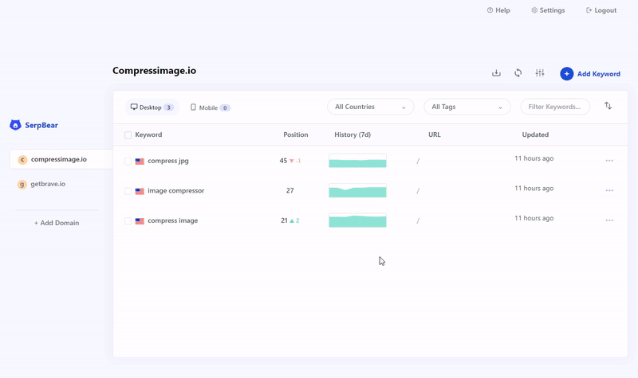

# SerpBear CI/CD pipeline

Deploy SerpBear server with CI/CD on Elestio

 
 

# Once deployed ...

You can can open SerpBear UI here:

    URL: https://[CI_CD_DOMAIN]
    Login: root
    password: [ADMIN_PASSWORD]
